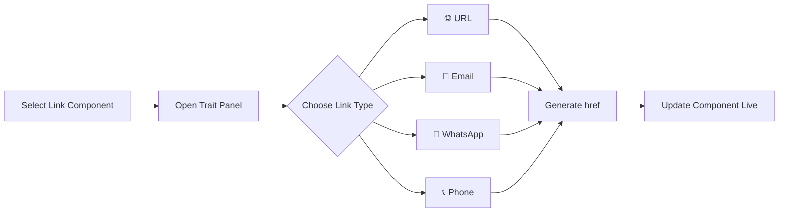

# 🚀 GrapesJS URL Manager Plugin

<div align="center">


### 🔗 Smart Hyperlink Management for GrapesJS

A modern GrapesJS plugin that transforms boring link editing into a clean, powerful, and intuitive experience.

Configure:

🌐 URLs • 📧 Emails • 💬 WhatsApp • 📞 Phone Links
with live updates, SPA routing support, and a beautiful tabbed UI.

</div>

---

# ✨ Why Use This Plugin?

Managing links inside GrapesJS can become repetitive and messy.

**GrapesJS URL Manager** solves that by providing:

✅ A sleek tab-based interface
✅ Dynamic input fields
✅ Real-time `href` generation
✅ SPA navigation support
✅ Inline SVG icons
✅ Better UX for link management

---

# 🎯 Features

<table>
<tr>
<td width="50%">

## 🔗 Multiple Link Types

Easily switch between:

* 🌐 Website URLs
* 📧 Email Links
* 💬 WhatsApp Messages
* 📞 Telephone Links

</td>

<td width="50%">

## ⚡ Smart Behaviour

* Live `href` updates
* Open in new tab option
* SPA toggle support
* Dynamic trait rendering

</td>
</tr>
</table>

---

# 🖼️ Preview

## 🌐 URL Block in Editor


---

## 🎨 Tabbed Interface with Icons


---

## ⚡ SPA Routing Toggle


---

## 🧩 Final HTML Output


---

## 📧 Email Interface


---

## 💬 WhatsApp Message Builder


---

## 📞 Telephone Interface


---

# 📦 Installation

## Using npm

```bash
npm install grapesjs-url-manager
```

## Using yarn

```bash
yarn add grapesjs-url-manager
```

---

# 🔌 Usage

```javascript
import grapesjs from 'grapesjs';

import urlManagerComponent from 'grapesjs-url-manager/src/component';
import urlManagerTraits from 'grapesjs-url-manager/src/trait';

grapesjs.init({
  container: '#gjs',

  plugins: [
    urlManagerComponent,
    urlManagerTraits,
  ],
});
```

---

# ⚙️ How It Works

When a user selects a link component:


```mermaid
flowchart LR

A[Select Link Component]
--> B[Open Trait Panel]

B --> C{Choose Link Type}

C --> D[🌐 URL]
C --> E[📧 Email]
C --> F[💬 WhatsApp]
C --> G[📞 Phone]

D --> H[Generate href]
E --> H
F --> H
G --> H

H --> I[Update Component Live]
```

---

# 🔥 Generated Link Formats

| Link Type   | Generated Output                        |
| ----------- | --------------------------------------- |
| 🌐 URL      | `https://example.com`                   |
| 📧 Email    | `mailto:user@example.com`               |
| 💬 WhatsApp | `https://wa.me/911234567890?text=Hello` |
| 📞 Phone    | `tel:+911234567890`                     |

---

# 📁 Project Structure

```text
grapesjs-url-manager/
│
├── src/
│   ├── component.js
│   ├── trait.js
│   └── Assets/
│
├── dist/
│   └── grapesjs-url-manager.min.js
│
├── index.html
├── package.json
├── README.md
└── LICENSE
```

---

# 🚀 Roadmap

Planned features for upcoming releases:

* ✅ URL validation
* ✅ Email validation
* ✅ Link preview popup
* ✅ Reusable presets
* ✅ Tooltip editor
* ✅ Custom icons
* ✅ Copy link support

---

# 🤝 Contributing

Contributions are always welcome!

## Steps

```bash
# Fork the repository

# Clone your fork
git clone YOUR_REPOSITORY_URL

# Install dependencies
npm install

# Start development
npm run dev
```

---

<div align="center">

# ❤️ Built for the GrapesJS Community

Made with passion by Buddyx07

</div>
